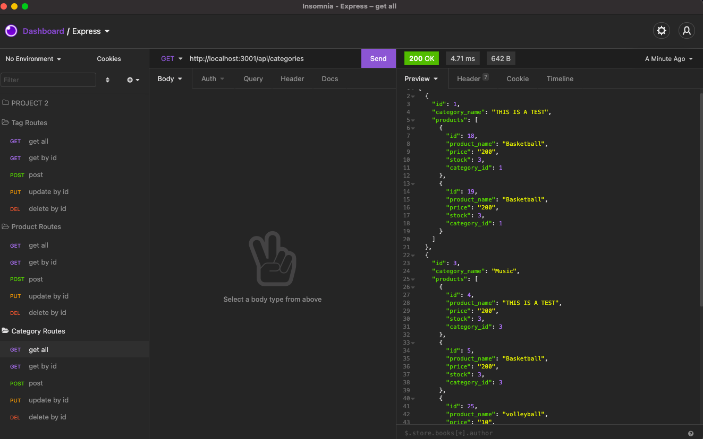

# ORM-E-Commerce-Back-End

## Description
This application is a back end for an e-commerce website that uses the latest technologies

## Table of contents
  - [Installation](#installation)
  - [Usage](#usage)
  - [Credits](#credits)
  - [License](#license)
  - [Test](#test)
  - [Questions](#questions)
  

## Installation
Video URL link  : ***https://watch.screencastify.com/v/2Y0zy0K34j0mE3eJrlNG***  

## Usage
Give a functional Express.js API,
when I add my database name, MySQL username, and MySQL password to an environment variable file
then I am able to connect to a database using Sequelize
when I enter schema and seed commands
then a development database is created and is seeded with test data
when I enter the command to invoke the application
then my server is started and the Sequelize models are synced to the MySQL database
when I open API GET routes in Insomnia Core for categories, products, or tags
then the data for each of these routes is displayed in a formatted JSON
when I test API POST, PUT, and DELETE routes in Insomnia Core
then I am able to successfully create, update, and delete data in my database

## Credits
Received help from:  
Jayla De'nae - peer  

This application uses:  
Express.js  
MySQL2  
Sequelize

## License

## Contributions
n/a
## Test
n/a
## Questions
Github: Ismeny Saguilan - https://github.com/Ismeny  
Email: menysag2@gmail.com